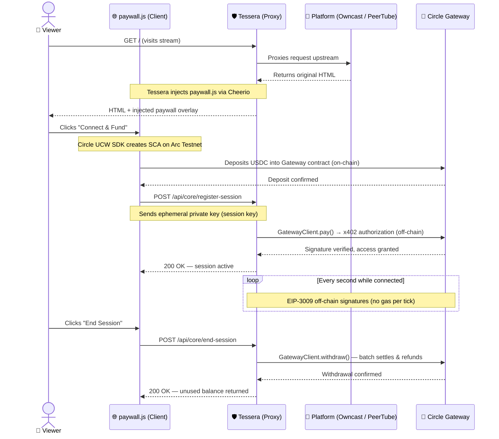

# Tessera

<div align="center">
  <p>
    
    
    
    
  </p>
  <p>
    
    
    
    
  </p>
</div>

**A payment sidecar that adds per-second nanopayments to any self-hosted platform.**

> **TL;DR:** Point Tessera at your Owncast, PeerTube, or any webhook-emitting server and your users start paying in USDC — by the second, by the article, or as a tip. Powered by the Circle x402 Gateway and the Arc Testnet. No platform modification required.

Tessera is a payment sidecar: a separate process that runs alongside your platform, intercepts the HTML response, injects the payment overlay, and handles the entire Circle Gateway lifecycle (deposit → authorize → batch settle → withdraw) — without touching your platform's source code.

The platform emits the same `USER_JOINED` / `USER_PARTED` events it has always emitted. Tessera does the rest.

---

## Table of Contents
- [How It Works](#how-it-works)
- [Supported Platforms](#supported-platforms)
- [Proof of Concept](#proof-of-concept)
- [Quick Start](#quick-start)
- [Project Structure](#project-structure)
- [Building a Connector](#building-a-connector)
- [Architecture & Fees](#architecture--fees)
- [Tech Stack](#tech-stack)
- [License](#license)

---

## How It Works



1. **Viewer opens the platform** → Tessera proxies the request and injects the paywall overlay into the HTML response.
2. **Viewer funds a session** → A Circle Smart Contract Account (SCA) is created on Arc Testnet. The viewer deposits USDC into the Circle Gateway. This is the only on-chain transaction.
3. **Session registers** → The client posts the ephemeral session key to Tessera. The GatewayClient makes a single x402 authorization call to unlock access.
4. **Billing runs off-chain** → Every second, an EIP-3009 signature authorizes a micro-payment. No gas. No blockchain transaction per tick.
5. **Viewer leaves** → The client calls `/end-session`. The Gateway batches all pending authorizations, settles on Arc Testnet, and refunds the unused balance to the viewer's wallet.

---

## Supported Platforms

| Platform | Integration Type | Notes |
|---|---|---|
| **Owncast** | Built-in connector | Tessera acts as a reverse proxy. Set your Owncast URL in `cashier.config.ts`. No extra plugins needed. |
| **PeerTube** | Plugin + connector | PeerTube requires a companion plugin to emit webhooks. **[Install the PeerTube Plugin →](https://github.com/JaDi03/peertube-plugin-arc-cashier)** |

*Want to add Jellyfin, Ghost, Immich, or your own app? See [Building a Connector](#building-a-connector).*

---

## Proof of Concept

**Live Demo (Viewer Flow)**

<video src="https://github.com/user-attachments/assets/616387d0-0704-403e-93c3-1f808dd0d0ca" controls autoplay loop muted playsinline width="100%"></video>

**Backend Logs & On-Chain Settlement**

The proxy silently handles off-chain EIP-3009 authorizations every second and batch-settles via the Circle Gateway on Arc Testnet when the session ends.

<p align="center">
  
  &nbsp;
  
</p>

---

## Quick Start

### Prerequisites
- Node.js v22+
- A supported platform running locally (Owncast on `:8080`, PeerTube on `:9000`, etc.)
- Circle API credentials ([Create an account](https://console.circle.com))
- Arc Testnet USDC for testing ([Circle Faucet](https://faucet.circle.com))

### Install & Run

```bash
git clone https://github.com/JaDi03/-Arc-Cashier.git
cd arc-cashier
nvm use          # Reads .nvmrc, switches to Node v22
npm install
cp .env.example .env
```

Edit `.env` with your Circle API key, App ID, and seller private key. Then configure which connector to activate:

```bash
# src/cashier.config.ts
connectors: [
    {
        name: 'owncast',
        upstreamUrl: 'http://127.0.0.1:8080',
        ratePerSecond: 0.0001, // $0.0001 USDC/sec ≈ $0.36/hour
    }
]
```

Start the dev server:

```bash
npm run dev
```

Tessera will start on `http://localhost:3000` and proxy all traffic to your upstream platform.

### Production Deployment

```bash
npm run build   # Compiles TypeScript to dist/
npm start       # Runs the compiled output
```

Or use the included `Dockerfile` to deploy to any Docker-compatible host.

---

## Project Structure

```
.
├── src/
│   ├── core/                        # Platform-agnostic payment engine
│   │   ├── routes.ts                # All API endpoints (x402, CCTP, Circle UCW)
│   │   ├── session.ts               # Per-second billing and settlement
│   │   ├── session.spec.ts          # Unit tests
│   │   ├── wallet.ts                # Ephemeral session key management
│   │   ├── wallet.spec.ts           # Unit tests
│   │   ├── creators.ts              # Creator registry (payout addresses)
│   │   └── types.ts                 # Connector interface contract
│   │
│   ├── connectors/                  # Platform adapters
│   │   ├── owncast/
│   │   │   ├── index.ts             # Implements Connector interface
│   │   │   ├── webhooks.ts          # USER_JOINED / USER_PARTED → engine
│   │   │   └── proxy.ts             # Reverse proxy + HTML injection (Cheerio)
│   │   └── peertube/
│   │       ├── index.ts
│   │       └── webhooks.ts
│   │
│   ├── ui/                          # Shared frontend assets (paywall overlay)
│   │   ├── paywall.js               # Client-side state machine
│   │   └── paywall.css
│   │
│   ├── cashier.config.ts            # Which connectors to load at startup
│   ├── server.ts                    # Dynamic connector loader
│   └── index.ts                     # Entry point
│
├── .github/workflows/ci.yml         # GitHub Actions CI
├── docs/
│   ├── BUILDING_A_CONNECTOR.md
│   └── ARCHITECTURE.md
├── Dockerfile
└── .env.example
```

---

## Building a Connector

Adding a new platform takes ~100 lines of code. See [docs/BUILDING_A_CONNECTOR.md](docs/BUILDING_A_CONNECTOR.md) for the full guide.

Implement the `Connector` interface from `src/core/types.ts`:

```typescript
import type { Connector } from '../../core/types';
import { sessionService } from '../../core/session';

const myConnector: Connector = {
    name: 'MyPlatform',
    register(app, config) {
        // 1. Listen for your platform's presence events (webhooks, SSE, etc.)
        app.post('/api/connectors/myplatform/webhook', (req, res) => {
            const { event, userId } = req.body;

            if (event === 'USER_JOINED') {
                sessionService.recordJoin(userId, config.ratePerSecond);
            }
            if (event === 'USER_PARTED') {
                sessionService.recordPartAndSettle(userId);
            }
            res.sendStatus(200);
        });
    },
};

export default myConnector;
```

---

## Architecture & Fees

Tessera uses the Circle x402 Gateway for high-frequency off-chain micro-authorizations and the Circle CCTP (domain 26) for cross-chain USDC bridging into Arc Testnet.

For detailed architecture diagrams, fee breakdown, and settlement logic, see **[docs/ARCHITECTURE.md](docs/ARCHITECTURE.md)**.

**Fee summary:**
- Circle Gateway withdrawal fee: ~0.5%
- Arc Testnet gas (paid in USDC): negligible per batch
- Platform fee: configurable per creator in `creators.json` (default 10%, probabilistic routing)

---

## Tech Stack

| Package | Purpose |
|---|---|
| [`@circle-fin/x402-batching`](https://www.npmjs.com/package/@circle-fin/x402-batching) | Circle Gateway client (deposit, pay, withdraw) |
| [`@circle-fin/user-controlled-wallets`](https://www.npmjs.com/package/@circle-fin/user-controlled-wallets) | Circle UCW SDK — Smart Contract Accounts on Arc Testnet |
| [`viem`](https://viem.sh/) | Type-safe EVM interactions (CCTP, Arc Testnet) |
| [`express`](https://expressjs.com/) | HTTP proxy server |
| [`http-proxy-middleware`](https://github.com/chimurai/http-proxy-middleware) | Reverse proxy with response interception |
| [`cheerio`](https://cheerio.js.org/) | Server-side HTML injection |
| [`typescript`](https://www.typescriptlang.org/) | Strict typing throughout |

---

## License

Apache-2.0
