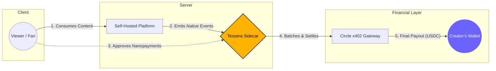

[Documentation](https://jadi03.github.io/tessera/)

<div align="center">
  
  <br>
  
  **Payment Sidecar for Self-Hosted Platforms**
  <br><br>

  <!-- Row 1: Status Badges -->
  <a href="https://github.com/JaDi03/tessera/actions"></a>
  <a href="https://github.com/JaDi03/tessera/releases"></a>
  <a href="https://github.com/JaDi03/tessera/blob/main/LICENSE"></a>
  <br>
  <!-- Row 2: Tech Stack Badges -->
  <a href="https://nodejs.org/"></a>
  <a href="https://www.typescriptlang.org/"></a>
  <a href="https://developers.circle.com/gateway/nanopayments"></a>
  <a href="https://docs.arc.network"></a>
</div>

---

**Documentation**: [https://jadi03.github.io/tessera/](https://jadi03.github.io/tessera/)

**Live Playground**: [https://trytessera.xyz](https://trytessera.xyz)

---

*Payment sidecar for self-hosted platforms enabling instant, per-second streaming payments and direct tipping.*

> **TL;DR:** Point Tessera at your self-hosted platform and your users start paying in USDC - by the second, by the action, or as a tip - without modifying a single line of your platform's source code.

---

## Table of Contents
- [The Self-Hosted Monetization Layer](#the-self-hosted-monetization-layer)
- [Why Arc Network?](#why-arc-network)
- [How It Works](#how-it-works)
- [Supported Platforms](#supported-platforms)
- [Quick Start](#quick-start)
- [Project Structure](#project-structure)
- [Tech Stack](#tech-stack)
- [License](#license)

---

## The Self-Hosted Monetization Layer

The hardest problem for any new Web3 payments primitive is distribution. Traditional crypto-native campaigns (airdrops, token incentives) fail to reach the creator economy because creators and communities are focused on content, not complex blockchain configurations.

Tessera takes a different approach: **we bring the payment rails to where the creators and audiences already live.**

By integrating as a lightweight, non-intrusive payment sidecar directly into self-hosted platforms, Tessera attaches payments to data structures that these systems naturally emit (webhook events, presence events, or access logs). Creators gain access to frictionless monetization, and viewers pay only for what they consume - all without requiring a dedicated blockchain setup from the host.

---

## Why Arc Network?

Implementing micro-billing or per-second streaming payments is economically impossible on traditional fiat rails (where Stripe or PayPal transaction fees impose a high floor, e.g., 30¢ + 2.9%). Traditional Web3 networks also struggle because users must acquire and hold separate, volatile native tokens just to pay for transaction gas fees.

Tessera solves this by running its settlement core on the **Arc Network**:

*   **USDC-Native Gas:** Viewers and creators interact entirely with USDC. Gas fees are paid directly in USDC, removing the friction of holding separate native gas tokens.
*   **Frictionless Micropayments:** With an average transaction cost of **~$0.01 USDC**, the economic floor is removed. A creator can collect micro-tips or per-second watch royalties without fees consuming their revenue.
*   **Decentralized Self-Hosting:** Fiat alternatives (like Liberapay) must centralize their deployments to pool donations and bypass payment processor fees. Because Arc's fees are sub-penny, every instance administrator can run their own self-hosted Tessera sidecar independently, keeping the federated web truly decentralized.

---

## How It Works

Tessera acts as a reverse proxy sitting between your users and your self-hosted platform.



1.  **HTML Injection:** Tessera intercepts HTTP traffic and automatically injects the client-side paywall script (`paywall.js`) into the platform's HTML responses.
2.  **Wallet & Gateway Deposit:** The viewer funds a session. Circle's User-Controlled Wallets (UCW) SDK creates a non-custodial Smart Contract Account (SCA) on the Arc Network, and deposits USDC into the Circle Gateway.
3.  **Off-Chain Streaming:** While watching, the client signs off-chain EIP-3009 payment signatures every second. This enables gasless streaming: no blockchain transactions are executed while playing.
4.  **Batch Settlement:** When the viewer leaves, Tessera stops billing. The client calls `/end-session`, triggering the Circle Gateway to batch-settle the accumulated balance to the creator and refund any unused balance to the viewer.

---

## Supported Platforms

| Platform | Integration Type | Status |
|---|---|---|
| [PeerTube](https://joinpeertube.org/) | Plugin + Webhook Connector | Live |
| [Owncast](https://owncast.online/) | Built-in Reverse Proxy Connector | Soon (In Development) |

---

## Quick Start

```bash
git clone https://github.com/JaDi03/tessera.git
cd tessera
npm install
npm run setup
```

For detailed installation, configuration, and deployment guides, see the [Quick Start Guide](https://jadi03.github.io/tessera/getting-started/).

---

## Project Structure

```text
tessera/
├── docs/                    # MkDocs documentation site source files
├── scripts/                 # Setup and deployment helper scripts
├── src/
│   ├── connectors/          # Platform-specific webhook and proxy adapters
│   ├── core/                # Core settlement engine and gateway integration
│   ├── ui/                  # Injected client paywall interface assets
│   ├── server.ts            # Express server configuration and routing
│   └── tessera.config.ts    # Main sidecar configuration registry
├── package.json             # Engine dependencies and execution scripts
└── tsconfig.json            # TypeScript configuration
```

---

## Project Structure

```text
tessera/
├── docs/                    # MkDocs documentation site source files
├── scripts/                 # Setup and deployment helper scripts
├── src/
│   ├── connectors/          # Platform-specific webhook and proxy adapters
│   ├── core/                # Core settlement engine and gateway integration
│   ├── ui/                  # Injected client paywall interface assets
│   ├── server.ts            # Express server configuration and routing
│   └── tessera.config.ts    # Main sidecar configuration registry
├── package.json             # Engine dependencies and execution scripts
└── tsconfig.json            # TypeScript configuration
```

---

## Tech Stack

- [Circle x402 Gateway](https://developers.circle.com/gateway/nanopayments): Protocol for batched off-chain micropayments.
- [Circle UCW SDK](https://developers.circle.com/wallets/user-controlled): User-controlled wallets on Arc Testnet.
- [Circle CCTP Forwarding](https://www.circle.com/cross-chain-transfer-protocol): Cross-chain USDC deposits from other EVM networks.
- [Arc Testnet](https://docs.arc.network): USDC-native gas fee layer.
- [EIP-3009](https://eips.ethereum.org/EIPS/eip-3009): Off-chain transfer signatures.
- [viem](https://viem.sh/): EVM interaction library.
- [Express](https://expressjs.com/): Reverse proxy engine.

---

## License

Apache-2.0 - see [LICENSE](LICENSE) for details.
