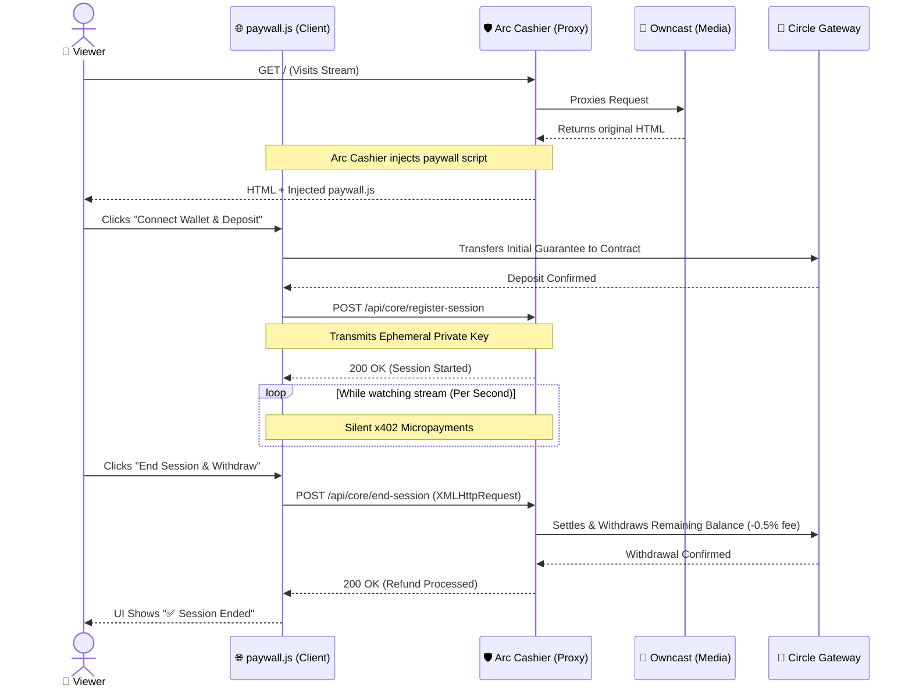
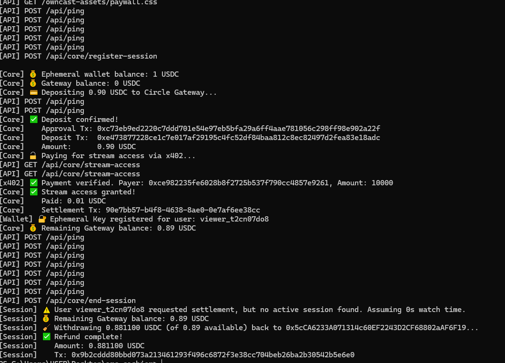
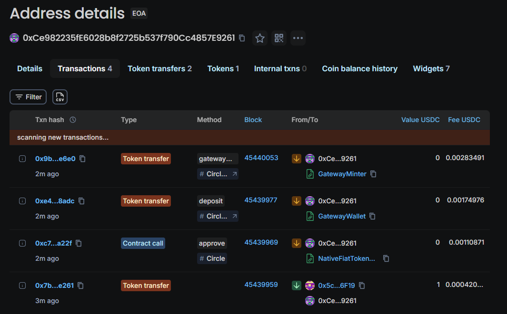
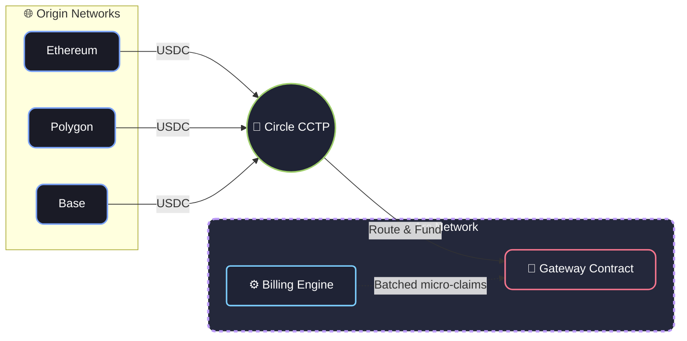

# Arc Cashier

<div align="center">
  <p>
    
    
    
    
  </p>
</div>

**Per-second streaming payments for self-hosted platforms, powered by Circle x402.**

Arc Cashier is a payment sidecar that sits between your viewers and your self-hosted streaming platform. It bills viewers by the second using [Circle Gateway](https://developers.circle.com/gateway) and the [x402 protocol](https://x402.org): gasless off-chain micropayments settled in batches on-chain.

The platform (Owncast, PeerTube, Jellyfin, etc.) never sees a wallet or a payment. It emits the same `USER_JOINED` / `USER_PARTED` events it has always emitted. Arc Cashier does the rest.

---

## Table of Contents
- [How It Works](#how-it-works)
- [Proof of Concept](#proof-of-concept)
- [Quick Start](#quick-start)
- [Project Structure](#project-structure)
- [Building a Connector](#building-a-connector)
- [Primitives for Arc Builders](#primitives-for-arc-builders)
- [Tech Stack](#tech-stack)
- [License](#license)

---

## How It Works



1. **Viewer opens stream** → Arc Cashier proxies the request to Owncast and injects the paywall overlay.
2. **Viewer deposits an initial guarantee** → Funds flow to an ephemeral wallet, then into the Circle Gateway smart contract.
3. **Session begins** → The client calls `POST /api/core/register-session` with their ephemeral key.
4. **Micropayments flow** → The system bills the viewer continuously via gasless x402 signatures.
5. **Viewer leaves** → The client triggers `POST /api/core/end-session` to immediately settle the final amount and withdraw the unused balance back to the viewer's wallet.

---

## Proof of Concept

**Live Demo (Viewer Flow)**  
<video src="https://github.com/user-attachments/assets/616387d0-0704-403e-93c3-1f808dd0d0ca" controls autoplay loop muted playsinline width="100%"></video>


**Backend Verification & On-Chain Settlement**  
The backend silently handles gasless x402 signatures every second, eventually settling the remainder directly on the Arc Testnet via the Circle Gateway smart contract.

<p align="center">
  
  &nbsp;
  
</p>

---

## Quick Start

### Prerequisites
- Node.js v22+
- An Owncast instance (or any supported platform) running
- MetaMask with Arc Testnet USDC ([Circle Faucet](https://faucet.circle.com))

### Ideal Fork Flow (Development)

Arc Cashier provides a streamlined workflow for developers looking to fork, test, and contribute:

```bash
git clone https://github.com/JaDi03/Arc-Cashier.git
cd arc-cashier
nvm use          # Reads .nvmrc and switches to Node v22
npm install
cp .env.example .env
```

Edit `.env` and `src/cashier.config.ts` with your specific settings (see comments in the files).

Run the development server:
```bash
npm run dev      # Hot reloads using ts-node
```

### Production Deployment

For production, compile the TypeScript code to JavaScript. Using `ts-node` in production is not recommended.

```bash
npm run build    # Compiles code to dist/
npm start        # Runs production-ready js
```

Alternatively, you can use the provided `Dockerfile` to deploy a containerized instance of Arc Cashier anywhere Docker is supported.

---

## Project Structure

```
.
├── src/
│   ├── core/                        # The payment engine (platform-agnostic)
│   │   ├── types.ts                 # Connector interface: the main primitive
│   │   ├── routes.ts                # x402 Gateway integration (deposit, pay)
│   │   ├── session.ts               # Per-second billing + refund via withdraw()
│   │   ├── session.spec.ts          # Unit tests
│   │   ├── wallet.ts                # Ephemeral key management
│   │   └── wallet.spec.ts           # Unit tests
│   │
│   ├── connectors/                  # Platform adapters (plug-in architecture)
│   │   └── owncast/                 # Reference connector
│   │       ├── index.ts             # Implements Connector interface
│   │       ├── webhooks.ts          # Translates Owncast events → engine calls
│   │       ├── proxy.ts             # Reverse proxy + paywall injection
│   │       └── public/              # Frontend paywall assets
│   │
│   ├── cashier.config.ts            # Which connectors to load
│   ├── server.ts                    # Dynamic connector loader
│   └── index.ts                     # Entry point
│
├── .github/workflows/ci.yml         # GitHub Actions CI pipeline
├── docs/                            # Deep-dive documentation and guides
│   └── BUILDING_A_CONNECTOR.md      # How to build custom platform connectors
├── CONTRIBUTING.md                  # Guidelines for new developers
├── Dockerfile                       # Production container build
└── eslint.config.mjs                # Code quality rules
```

---

## Building a Connector

Arc Cashier is designed so that adding a new platform takes ~100 lines of code. See [docs/BUILDING_A_CONNECTOR.md](docs/BUILDING_A_CONNECTOR.md) for the full guide.

The short version: implement the `Connector` interface from `src/core/types.ts`:

```typescript
import type { Connector, ConnectorConfig } from '../../core/types';

const myConnector: Connector = {
    name: 'MyPlatform',
    register(app, config) {
        // 1. Listen for your platform's presence events
        // 2. Call sessionService.recordJoin(userId) on join
        // 3. Call sessionService.recordPartAndSettle(userId) on leave
    },
};

export default myConnector;
```

---

## Primitives for Arc Builders

| Primitive | Description |
|---|---|
| **Per-second billing engine** | `session.ts`: tracks presence, computes duration, settles per-second |
| **Sidecar pattern** | Monetize any platform without modifying its source code |
| **Reverse proxy injection** | Inject payment UI into upstream HTML via Cheerio |
| **Ephemeral wallet abstraction** | Disposable keys so users never expose their main private key |
| **Connector interface** | Standardized contract for adapting any webhook-emitting platform |
| **x402 Gateway lifecycle** | Full deposit → pay → withdraw flow via Circle SDK |

---

## Production & Architecture (V1)

Arc Cashier V1 is designed to be a robust, developer-friendly MVP. To ensure stability and ease of deployment, the following architectural decisions and limitations are present in this version:

### Architecture: Universal Deposits (CCTP) & Arc Settlement

While Arc Cashier requires the **Arc Network** to operate its core billing engine, **viewers can fund their sessions from any supported network** (Ethereum, Polygon, Base, etc.) thanks to **Circle's CCTP** (Cross-Chain Transfer Protocol).

<details>
<summary><b>View Network Architecture Diagram</b></summary>



</details>

**Why must the settlement engine run exclusively on Arc?**

Arc Cashier is designed for **high-frequency, per-second micro-billing**. Implementing this economic model on traditional EVM networks is economically unviable due to unpredictable gas fees. 

By leveraging the **Arc Network** combined with the **x402 protocol**:

- **Seamless Onboarding**: Viewers deposit USDC from their preferred chain. CCTP securely routes the funds to the Gateway smart contract behind the scenes.
- **Gasless Streaming**: Once the session begins, viewers sign off-chain cryptographic proofs every second without paying any gas.
- **Batched Settlement**: The Circle Gateway aggregates thousands of these micro-signatures and settles the final balances efficiently on the Arc Network.
- **Economic Viability**: Arc's ultra-low latency and negligible transaction costs ensure that network fees never consume the actual value of the stream. On traditional networks, watching a 10-minute stream could cost more in gas than the content itself. Arc makes the math work.

### Environment Configuration
- **Dynamic Routing:** `PUBLIC_URL` is required in production to ensure the Gateway can map callbacks and references correctly, bypassing the hardcoded `localhost` limitations.
- **Gas Buffer:** `RETAINED_GAS_AMOUNT` (default 0.1 USDC) is utilized to ensure the ephemeral wallet always retains enough native token for on-chain interactions without failing.

### Security & Performance
- **Rate Limiting:** Critical endpoints (`/register-session` and `/end-session`) are protected by IP rate limiting to prevent spam and DDoS attempts.
- **Memory Optimization:** `GatewayClient` instances are cached in memory. Ephemeral keys and instances are strictly wiped using a safe sweep upon session termination.
- **Dynamic Top-Up:** Viewers are alerted dynamically when their balance drops below 5 minutes of viewing time, allowing them to top-up without interrupting the video stream.

### Observability
- **Healthcheck:** A robust endpoint at `GET /health` provides real-time status of active sessions and connectivity to the Circle Gateway, suitable for integration with Prometheus or UptimeKuma.

### V1 Limitations & Trade-offs
- **Polling over Webhooks:** To maximize developer experience (DX) and allow seamless testing on `localhost` without tunnels (like ngrok), V1 actively polls Circle for deposit confirmations instead of relying on Webhooks.
- **Fixed Payment Scheme:** The protocol currently forces the `GatewayWalletBatched` scheme on Arc Testnet. While x402 supports dynamic schemes like `CompositeEvmScheme`, they are disabled in V1 to maintain strict focus on streaming micro-payments.

---

## Tech Stack

- **[Circle x402-batching SDK](https://www.npmjs.com/package/@circle-fin/x402-batching)**: Gasless micropayments
- **[Viem](https://viem.sh/)**: Type-safe Ethereum interactions
- **[Express](https://expressjs.com/)**: HTTP server
- **[TypeScript](https://www.typescriptlang.org/)**: Strict typing
- **[Cheerio](https://cheerio.js.org/)**: HTML injection

## License

Apache-2.0
