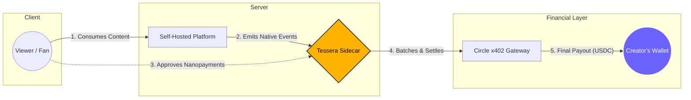
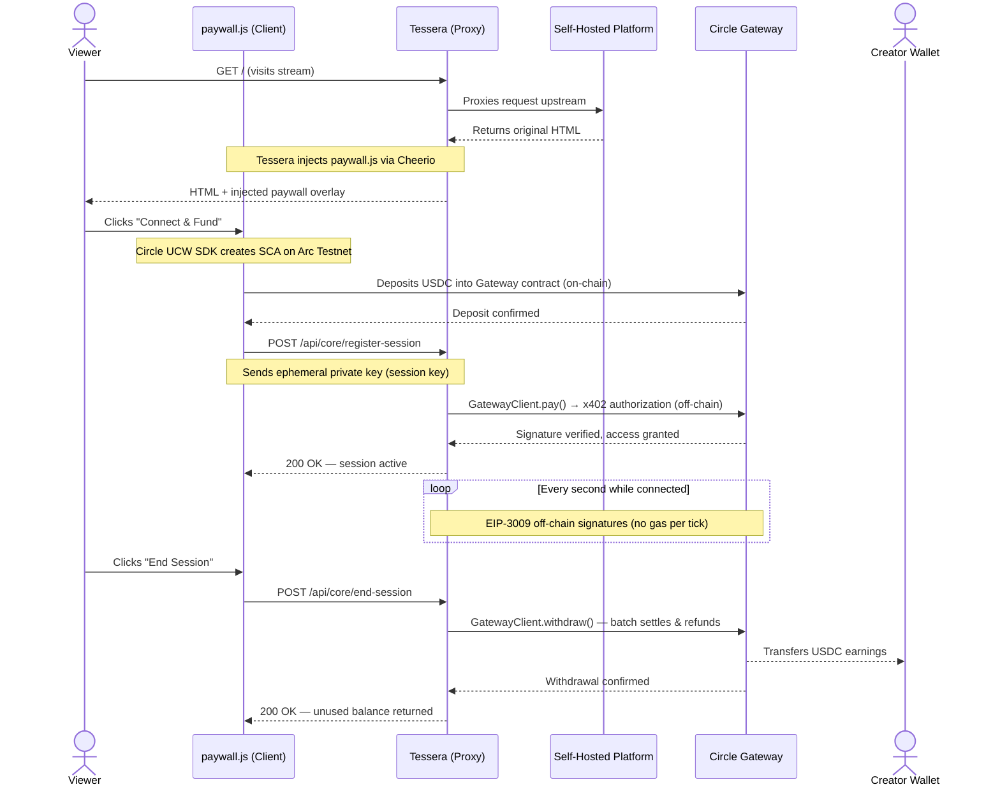

<div align="center" markdown="1">


**Payment Sidecar for Self-Hosted Platforms**

*Per-second nanopayments powered by [Circle x402](https://www.circle.com/nanopayments) & [Arc](https://www.arc.network)*

[](https://github.com/JaDi03/tessera/actions)
[](https://github.com/JaDi03/tessera/releases)
[](https://github.com/JaDi03/tessera/blob/main/LICENSE)
[](https://nodejs.org/)
[](https://www.typescriptlang.org/)
[](https://developers.circle.com/gateway/nanopayments)
[](https://docs.arc.network)

</div>

---

## TL;DR

Point Tessera at your self-hosted platform and your users start paying in USDC — by the second, by the article, or as a tip. No platform modification required.

Tessera is a **payment sidecar**: a separate process that runs alongside your platform, intercepts the HTML response, injects the payment overlay, and handles the entire [Circle Gateway](https://developers.circle.com/gateway) lifecycle (deposit → authorize → batch settle → withdraw) — without touching your platform's source code.

The platform emits its native events as it always has. Whether that is a `USER_JOINED` webhook for a live stream, a scrobble event for a music track, or a shared-link resolution for a photo gallery, Tessera intercepts these signals and does the rest.

---

## The Problem

Self-hosted platforms empower creators and communities with ownership and control, but they leave a critical gap unfilled: **there is no native way for audiences to support the infrastructure and creators they value.**

| Stakeholder | Pain Point |
|---|---|
| **Instance Administrators** | Bear 100% of infrastructure costs — servers, storage, bandwidth — with limited tools to recoup expenses beyond donations or ads |
| **Creators** | Produce content on platforms they don't control, with no built-in mechanism to receive direct support from their audience |
| **Viewers / Readers** | Want to support creators they love, but are forced into platform-wide subscriptions that don't reflect actual consumption |

The result is a sustainability crisis: instances shut down when admins can no longer afford them, creators migrate to commercial platforms, and communities fragment.

---

## The Solution

Tessera is a **payment sidecar**: a separate process that sits between your users and your platform, adding a flexible nanopayment layer (be it per-second, per-action, or direct tips) without modifying any platform code.



**Key Design Principles:**

- **Zero platform modification** — Tessera acts as a reverse proxy; your platform's code remains untouched
- **Pay only for what you consume (or tip)**: Whether it is per-second billing for a stream, a fee for an article, or a voluntary tip for a creator, the audience pays directly for value without rigid monthly subscriptions
- **Gas-free streaming** — Off-chain EIP-3009 signatures every second; batch settlement only happens when the session ends
- **Cross-chain deposits** — Viewers can fund from any supported chain via Circle CCTP; settlement happens on Arc Testnet

---

## How It Works



**In plain terms:**

1. **Viewer opens the platform** → Tessera proxies the request and injects the paywall overlay into the HTML response
2. **Viewer funds a session** → A Circle Smart Contract Account (SCA) is created on Arc Testnet. The viewer deposits USDC into the Circle Gateway. This is one of the two on-chain transactions (along with the subsequent cash-out/withdrawal).
3. **Session registers** → The client posts the ephemeral session key to Tessera. The GatewayClient makes a single x402 authorization call to unlock access
4. **Billing runs off-chain** → Every second, an EIP-3009 signature authorizes a nanopayment. No gas. No blockchain transaction per tick
5. **Viewer leaves** → The client calls `/end-session`. Tessera stops billing, and the remaining funds stay in the Gateway contract. The viewer can manually withdraw/refund their balance to their wallet at any time via a `/cash-out` transaction.

## Supported Platforms & Use Cases

| Platform | Integration Type | Status |
|---|---|---|
| [Owncast](https://owncast.online/) | Built-in connector | Live |
| [PeerTube](https://joinpeertube.org/) | Plugin + connector | Live |

Tessera is designed to plug into the open-source creator stack where communities already live. Because it relies on standard event streams, it can be easily extended to support:

- **Music Servers (Navidrome, Koel)**: Per-listen royalties triggered by scrobble events.
- **Photo Libraries (Immich)**: Fractional licensing fees on shared-link resolves.
- **Feeds & Blogs (RSSHub, Ghost)**: Citation tolls or per-article subscriptions.

Want to add your platform? Tessera connectors are ~100 lines of code. See [Building a Connector](docs/connectors/building-a-connector.md) to get started.

---

## Quick Start

```bash
# 1. Clone the repository
git clone https://github.com/JaDi03/tessera.git
cd tessera

# 2. Install dependencies
npm install

# 3. Run the interactive setup wizard
npm run setup

# 4. Add your credentials to .env, compile, and start
npm run build
npm run start
```

Tessera starts on `http://localhost:3000` and proxies all traffic through the payment layer to your upstream platform.

For detailed installation, configuration, and deployment guides, see the [full documentation](https://github.com/JaDi03/tessera/tree/main/docs).

---

## Tech Stack

| Technology | Purpose | Why It Matters |
|---|---|---|
| [**Circle x402 Gateway**](https://developers.circle.com/gateway/nanopayments) | Batched nanopayment settlement & protocol | Enables gas-free USDC payments as small as $0.000001 using the open HTTP 402 standard |
| [**Circle UCW SDK**](https://developers.circle.com/wallets/user-controlled) | Smart Contract Accounts on Arc Testnet | Non-custodial wallets with social login, PIN, or biometrics |
| [**Circle CCTP Forwarding**](https://www.circle.com/cross-chain-transfer-protocol) | Cross-chain USDC bridging (Domain 26) | Allows viewers to deposit USDC from any supported source chain |
| [**Arc Testnet**](https://docs.arc.network) | Settlement layer (Chain ID 5042002) | Native USDC gas, sub-second finality, purpose-built for payments |
| [**EIP-3009**](https://eips.ethereum.org/EIPS/eip-3009) | Off-chain transfer authorization | Gasless cryptographic signatures for nanopayments |
| [**viem**](https://viem.sh/) | Type-safe EVM interactions | Modern TypeScript library for blockchain operations |
| [**Express**](https://expressjs.com/) | HTTP proxy server | Industry-standard Node.js web framework |

---

## Why Arc Network?

Tessera is designed for **high-frequency, per-second billing**. Implementing this economic model on traditional EVM networks is economically unviable due to unpredictable gas fees. 

By leveraging the **Arc Network** combined with the **x402 protocol**:

- **Native USDC Gas**: Forget about needing to hold a separate, volatile native token just to pay for transactions. Arc uses USDC natively for gas, meaning zero friction for users and creators.
- **Predictable, Ultra-Low Costs**: Arc is specifically designed for stablecoin-native applications, targeting an average transaction fee of **~$0.01 USDC**.
- **Gasless Streaming**: Once the session begins, viewers sign off-chain cryptographic proofs every second without paying any gas.
- **Batched Settlement**: The Circle Gateway aggregates thousands of these off-chain signatures and settles the final balances efficiently on the Arc Network.
- **Economic Viability**: On traditional networks, watching a 10-minute stream could cost more in gas than the content itself. Arc's ~$0.01 fees make the math work, ensuring that network costs never consume the actual value of the stream.

---

## Architecture Summary

Tessera uses a **sidecar pattern** to add payments without platform modifications. The architecture separates concerns into three layers:

**Core Engine** (`src/core/`) — Platform-agnostic payment logic: session management, per-second billing, wallet operations, and Circle Gateway integration via the x402 protocol.

**Platform Connectors** (`src/connectors/`) — Lightweight adapters that translate platform-specific events (webhooks, SSE, API calls) into the core engine's billing interface. Each connector is ~100 lines of TypeScript.

**Client Overlay** (`src/ui/`) — The paywall interface injected into the platform's HTML. Handles wallet connection, session funding, real-time billing display, and session termination.

For detailed architecture diagrams, fee breakdowns, and settlement logic, see [docs/ARCHITECTURE.md](docs/ARCHITECTURE.md).

---

## What This Enables

Tessera transforms how self-hosted platforms sustain themselves:

- **Creators** receive direct, per-second support from their audience, with settled earnings accumulating in their Gateway balance
- **Viewers** pay only for what they actually consume — no subscriptions, no lock-in, and zero platform fees

The economic model is simple: if a viewer watches a 10-minute stream at $0.01/minute, they pay $0.10. These nanopayments are aggregated off-chain and settled to the creator's Gateway balance, which the creator can subsequently withdraw to their personal wallet. Everyone wins.

---

## Documentation

- [Architecture & Fees](docs/ARCHITECTURE.md) — Detailed technical architecture, fee structure, and settlement flow
- [Building a Connector](docs/connectors/building-a-connector.md) — Add support for a new platform in ~100 lines of code
- [Contributing Guide](CONTRIBUTING.md) — Development setup, code standards, and submission process

---

## License

Apache-2.0 — see [LICENSE](LICENSE) for details.
