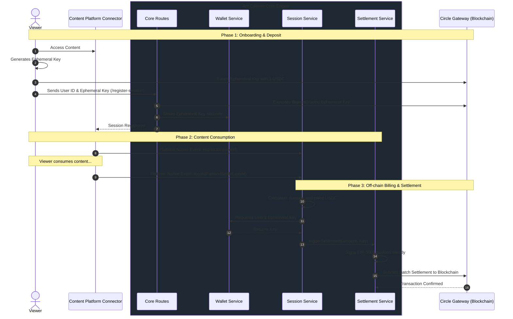

# ⚙️ Arc Cashier Core Engine

<div align="center">


[](https://www.typescriptlang.org/)
[](https://nodejs.org/)
[](https://www.circle.com/)
[](https://expressjs.com/)

*The agnostic, hyper-scalable, and secure heart of the Arc Web3 Streaming Payment ecosystem.*

</div>

---

## 📖 Overview

The **Arc Cashier Core Engine** is the central nervous system of the Arc Web3 payment infrastructure. It is a strictly platform-agnostic, headless microservice designed to handle the complex financial lifecycle of **Circle Nanopayments (x402 Batched Settlement)**. 

By abstracting away the intricacies of blockchain transactions, EIP-3009 mathematical signatures, and ephemeral session key management, the Core Engine allows external **Connectors** (Content Platform Plugins) to effortlessly monetize streaming content. The Core does not care *how* a connector tracks users (whether via Webhooks, WebSockets, API polling, or client-side heartbeats)—it simply exposes a standard set of internal methods to start billing and settle on-chain.

---

## 🧠 Architecture / Logic

The Core operates on a strictly Off-Chain signature batching model to ensure zero-gas latency during live streams, only touching the blockchain for the initial deposit and the final Batched Settlement.



---

## 🏗️ System Structure

The Core directory is surgically isolated from any platform-specific proxying, HTML injection, or UI logic.

```text
src/core/
├── routes.ts        # Exposes the base API (e.g., /register-session) for initial Gateway funding.
├── session.ts       # Tracks stream join/part events, calculates viewership duration, and triggers billing.
├── settlement.ts    # Interfaces directly with the Circle BatchFacilitatorClient for on-chain settlement.
└── wallet.ts        # The secure Wallet Abstraction layer mapping Session IDs to Ephemeral Private Keys.
```

---

## 🌟 Key Features

- **Platform Agnostic**: The core has zero dependencies on any streaming protocol. It simply listens for `recordJoin` and `recordPartAndSettle` invocations from surrounding connectors.
- **Batched Settlement (x402)**: Leverages Circle's advanced EIP-3009 authorization patterns to silently batch off-chain signatures without requiring users to sign every second.
- **Wallet Abstraction**: Completely shields the end-user from complex key management. Ephemeral keys are generated client-side, funded, and securely handed to the `wallet.ts` service for background signing.
- **Micro-billing Precision**: Calculates fractional USDC debt per-second based on exact streaming duration, ensuring creators get paid fairly and viewers only pay for what they consume.

---

## 🚀 Getting Started

### 1. Prerequisites
- Node.js v18+
- Active Circle Web3 Developer Account (Gateway configurations)
- Base Sepolia testnet RPC access

### 2. Implementation inside a Connector
To utilize the core from a new platform connector, simply import the specific services. The Core does NOT run standalone; it is mounted into an Express app by `src/server.ts`.

```typescript
import { sessionService } from '../../core/session';

// Example: When a viewer joins your custom streaming platform
sessionService.recordJoin(userId);

// Example: When a viewer leaves
await sessionService.recordPartAndSettle(userId);
```

---

## 🛠️ Built With

- [Circle x402-batching SDK](https://developers.circle.com) - Core nanopayments engine
- [Viem](https://viem.sh/) - Type-safe Ethereum interactions
- [Express](https://expressjs.com/) - High-performance routing
- [TypeScript](https://www.typescriptlang.org/) - Strict typing for financial security
