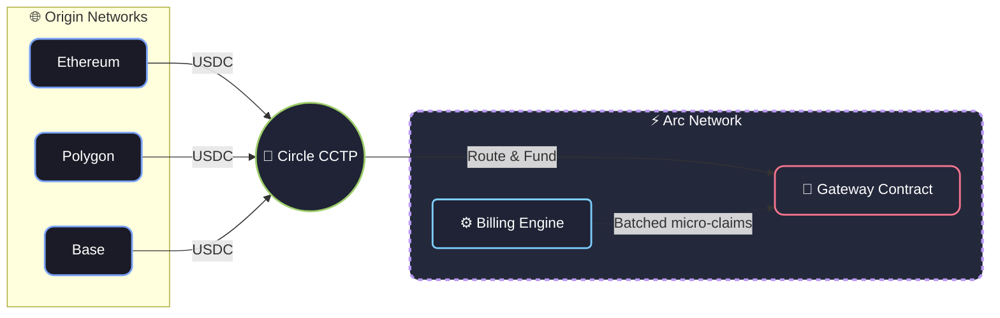

# Architecture & Fees

## Production & Architecture (V1)

Arc Cashier V1 is designed to be a robust, developer-friendly MVP. To ensure stability and ease of deployment, the following architectural decisions and limitations are present in this version:

### Architecture: Universal Deposits (CCTP) & Arc Settlement

While Arc Cashier requires the **Arc Network** to operate its core billing engine, **viewers can fund their sessions from any supported network** (Ethereum, Polygon, Base, etc.) thanks to **Circle's CCTP** (Cross-Chain Transfer Protocol).

**Why must the settlement engine run exclusively on Arc?**

Arc Cashier is designed for **high-frequency, per-second micro-billing**. Implementing this economic model on traditional EVM networks is economically unviable due to unpredictable gas fees. 

By leveraging the **Arc Network** combined with the **x402 protocol**:

- **Seamless Onboarding**: Viewers deposit USDC from their preferred chain. CCTP securely routes the funds to the Gateway smart contract behind the scenes.
- **Gasless Streaming**: Once the session begins, viewers sign off-chain cryptographic proofs every second without paying any gas.
- **Batched Settlement**: The Circle Gateway aggregates thousands of these micro-signatures and settles the final balances efficiently on the Arc Network.
- **Economic Viability**: Arc's ultra-low latency and negligible transaction costs ensure that network fees never consume the actual value of the stream. On traditional networks, watching a 10-minute stream could cost more in gas than the content itself. Arc makes the math work.

### 💸 Transparent Fee Structure

Arc Cashier minimizes fees, but it is not entirely free. Here is exactly where network and protocol fees apply:

1. **Initial Bridge / CCTP (On-chain):** The viewer pays standard gas fees on their origin network (e.g., Base or Ethereum) to bridge and fund their ephemeral wallet.
2. **Gateway Deposit (On-chain):** The initial deposit into the Circle Gateway smart contract requires a negligible Arc Network gas fee.
3. **Streaming (Off-chain):** **FREE.** The per-second signatures incur absolutely zero gas fees. This is the core x402 advantage.
4. **Settlement & Withdrawal:** When the session ends, Circle Gateway charges a **~0.5% protocol fee** on the final withdrawn amount.

### Environment Configuration
- **Dynamic Routing:** `PUBLIC_URL` is required in production to ensure the Gateway can map callbacks and references correctly, bypassing the hardcoded `localhost` limitations.
- **Gas Buffer:** `RETAINED_GAS_AMOUNT` (default 0.1 USDC) is utilized to ensure the ephemeral wallet always retains enough native token for on-chain interactions without failing.

### Security & Performance
- **Rate Limiting:** Critical endpoints (`/register-session` and `/end-session`) are protected by IP rate limiting to prevent spam and DDoS attempts.
- **Memory Optimization:** `GatewayClient` instances are cached in memory. Ephemeral keys and instances are strictly wiped using a safe sweep upon session termination.
- **Dynamic Top-Up:** Viewers are alerted dynamically when their balance drops below 5 minutes of viewing time, allowing them to top-up without interrupting the video stream.

### Observability
- **Healthcheck:** A robust endpoint at `GET /health` provides real-time status of active sessions and connectivity to the Circle Gateway, suitable for integration with Prometheus or UptimeKuma.

### V1 Limitations & Trade-offs
- **Polling over Webhooks:** To maximize developer experience (DX) and allow seamless testing on `localhost` without tunnels (like ngrok), V1 actively polls Circle for deposit confirmations instead of relying on Webhooks.
- **Fixed Payment Scheme:** The protocol currently forces the `GatewayWalletBatched` scheme on Arc Testnet. While x402 supports dynamic schemes like `CompositeEvmScheme`, they are disabled in V1 to maintain strict focus on streaming micro-payments.
