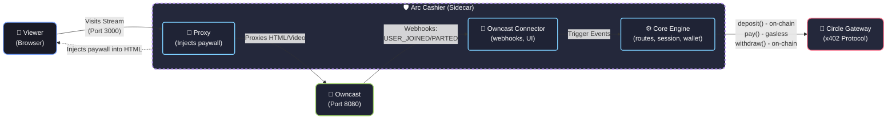

# Architecture

## Overview

Arc Cashier is a **payment sidecar** — a standalone process that sits between viewers and a self-hosted streaming platform. The platform doesn't need to be modified. Arc Cashier intercepts its traffic via a reverse proxy and monetizes it using Circle's x402 protocol.

## System Diagram

## Payment Lifecycle

### Phase 1: Deposit (on-chain, costs gas)

1. Viewer opens `http://localhost:3000` (the sidecar).
2. The reverse proxy fetches the page from Owncast (`:8080`) and injects `paywall.js`.
3. The paywall creates an **ephemeral wallet** (random private key, never leaves memory).
4. Viewer sends 1 USDC from MetaMask to the ephemeral wallet.
5. The frontend sends the ephemeral private key to the sidecar (`POST /api/core/register-session`).
6. The sidecar creates a `GatewayClient` and calls `deposit()` — this is an on-chain ERC20 transfer to Circle's Gateway contract.

### Phase 2: Access (off-chain, gasless)

7. The sidecar calls `GatewayClient.pay()` against its own protected endpoint (`/api/core/stream-access`).
8. Internally, this triggers the x402 flow:
   - `GET /api/core/stream-access` → returns **402 Payment Required** with `PaymentRequirements`
   - `GatewayClient` signs an **EIP-3009 TransferWithAuthorization** using **EIP-712** (off-chain, no gas)
   - Retry with `X-PAYMENT` header containing the signature
   - Circle Gateway API verifies and settles in batch
9. The paywall is removed, the stream is visible.

### Phase 3: Billing (passive, webhook-driven)

10. Owncast detects viewer presence and emits `USER_JOINED` webhook.
11. `sessionService.recordJoin(userId)` starts the meter.
12. When the viewer leaves (or connection drops for 15 seconds), Owncast emits `USER_PARTED`.
13. `sessionService.recordPartAndSettle(userId)` calculates watch time.

### Phase 4: Refund (on-chain, automatic)

14. The sidecar calls `GatewayClient.withdraw()` to send remaining Gateway balance back to the viewer's original MetaMask address.
15. The ephemeral wallet is discarded.

## Key Design Decisions

### Why an ephemeral wallet?
`GatewayClient` requires a private key to sign EIP-3009 authorizations. We can't extract the user's MetaMask private key (and shouldn't). The ephemeral wallet bridges this gap — it's a disposable key that only holds funds for the duration of one session.

### Why a reverse proxy?
The sidecar pattern means zero modifications to the upstream platform. Owncast doesn't know Arc Cashier exists. The proxy intercepts HTML responses and injects the paywall script using Cheerio. If you remove Arc Cashier, Owncast works exactly as before.

### Why not per-second on-chain settlement?
On-chain transactions cost gas and take time. Instead, we use Circle Gateway's batched settlement: the viewer deposits once (on-chain), then all subsequent payments are gasless off-chain signatures. Circle settles them in batches on-chain periodically. This means 1 on-chain tx per session, not 1 per second.

## Native USDC on Arc Testnet

Arc Testnet has a unique property: **USDC is the native gas token** (18 decimals). There's also an ERC20 precompile at `0x3600000000000000000000000000000000000000` (6 decimals) that mirrors the native balance. When you send native USDC via `value`, your ERC20 balance at the precompile address updates accordingly. The Circle Gateway SDK operates on the ERC20 contract (6 decimals) for `approve` + `deposit`.
