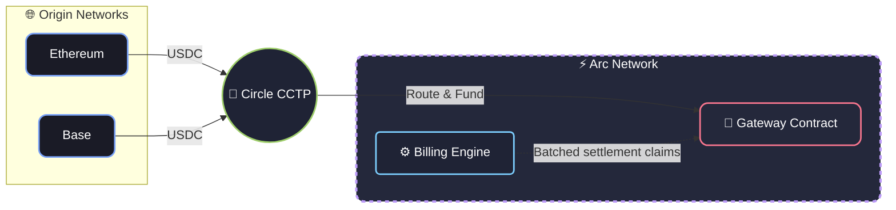

# Architecture & Fees

## Production & Architecture (V1)

Tessera V1 is designed to be a robust, developer-friendly MVP. To ensure stability and ease of deployment, the following architectural decisions and limitations are present in this version:

### Architecture: Universal Deposits (CCTP) & Arc Settlement

While Tessera requires the **Arc Network** to operate its core billing engine, **viewers can fund their sessions from any supported network** (Ethereum, Base, etc.) thanks to **Circle's CCTP** (Cross-Chain Transfer Protocol).

## Payment Models

Tessera supports two distinct payment mechanisms natively within the same sidecar infrastructure. Both operate entirely off-chain until the session ends.

### 1. Per-Second Streaming (Time-based)
This is the default mode for continuous content like live streams, music, or video playback. 
As long as the viewer's connection is active, the Tessera client silently generates an EIP-3009 cryptographic signature every second. The billing engine accumulates these signatures off-chain, verifying that the user has enough balance. The viewer is strictly charged for the exact time consumed.

### 2. Direct Tipping (Event-based)
Viewers can send one-off, voluntary contributions directly to the creator. 
When a viewer clicks the "Tip" button, a single, larger authorization signature is generated. This can occur simultaneously alongside an active per-second streaming session. Tips are aggregated into the same off-chain balance and settled together with the streaming costs when the session concludes.

## Fee Structure

Because Tessera relies heavily on off-chain EIP-3009 signatures, viewers only pay network fees for two on-chain transactions during the entire lifecycle of a session:

1. **Deposit (Gateway Funding):** When moving funds into the Gateway Smart Contract.
2. **Withdrawal (Cash Out):** When settling the session and pulling unused funds back to their wallet.

On the Arc Network, these transactions cost approximately **$0.01 USDC** in network fees (gas). 

**Cross-Chain Forwarding Fees:**
If a viewer decides to bridge funds from another network (e.g., Ethereum or Base) using Circle's CCTP Forwarding Service instead of direct funding, the Forwarding Service charges a flat **$0.20 USDC** service fee for the transfer.

---

**Why must the settlement engine run exclusively on Arc?**

Tessera is designed for **high-frequency, per-second billing**. Implementing this economic model on traditional EVM networks is economically unviable due to unpredictable gas fees. 

By leveraging the **Arc Network** combined with the **x402 protocol**:

- **Native USDC Gas**: Forget about needing to hold a separate, volatile native token just to pay for transactions. Arc uses USDC natively for gas, meaning zero friction for users and creators.
- **Predictable, Ultra-Low Costs**: Arc is specifically designed for stablecoin-native applications, targeting an average transaction fee of **~$0.01 USDC**.
- **Gasless Streaming**: Once the session begins, viewers sign off-chain cryptographic proofs every second without paying any gas.
- **Batched Settlement**: The Circle Gateway aggregates thousands of these off-chain signatures and settles the final balances efficiently on the Arc Network.
- **Economic Viability**: On traditional networks, watching a 10-minute stream could cost more in gas than the content itself. Arc's ~$0.01 fees make the math work, ensuring that network costs never consume the actual value of the stream.

### Environment Configuration
- **Dynamic Routing:** `PUBLIC_URL` is required in production to ensure the Gateway can map callbacks and references correctly, bypassing the hardcoded `localhost` limitations.
- **Gas Buffer:** `RETAINED_GAS_AMOUNT` (default 0.01 USDC) is utilized to ensure the ephemeral wallet always retains enough native token for on-chain interactions without failing.

### Security & Performance
- **Rate Limiting:** Critical endpoints (`/register-session` and `/end-session`) are protected by IP rate limiting to prevent spam and DDoS attempts.
- **Memory Optimization:** `GatewayClient` instances are cached in memory. Ephemeral keys and instances are strictly wiped using a safe sweep upon session termination.
- **Dynamic Top-Up:** Viewers are alerted dynamically when their balance drops below 5 minutes of viewing time, allowing them to top-up without interrupting the video stream.

### Observability
- **Healthcheck:** A robust endpoint at `GET /health` provides real-time status of active sessions and connectivity to the Circle Gateway, suitable for integration with Prometheus or UptimeKuma.

### V1 Limitations & Trade-offs
- **Polling over Webhooks:** To maximize developer experience (DX) and allow seamless testing on `localhost` without tunnels (like ngrok), V1 actively polls Circle for deposit confirmations instead of relying on Webhooks.
- **Fixed Payment Scheme**: The protocol currently forces the `GatewayWalletBatched` scheme on Arc Testnet. While x402 supports dynamic schemes like `CompositeEvmScheme`, they are disabled in V1 to maintain strict focus on streaming nanopayments.
