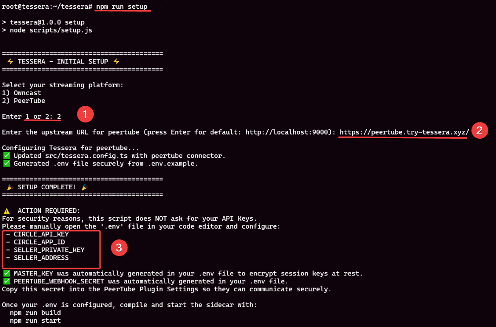
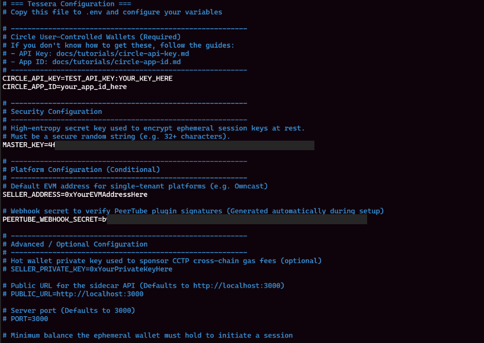

# Quick Start

Tessera is designed to be lightweight, but it relies on modern infrastructure and the Circle x402 Gateway. Follow these steps to get your sidecar running.

## 1. Prerequisites

- **Node.js**: Version **22 or higher** is required.
- **Git & Docker**: Required to clone and deploy the repository in production.
- **Circle Developer Account**: You need your `CIRCLE_API_KEY` and `CIRCLE_APP_ID`. [See the guide](../tutorials/circle-api-key.md) if you don't have them yet.
- **A Destination Wallet**: A standard EVM-compatible wallet address. Earnings accumulate in the Circle Gateway and you will use this wallet later to cryptographically sign your withdrawals.

## 2. Installation & Setup

Begin by cloning the official repository to the machine where you intend to run the sidecar.

```bash
git clone https://github.com/JaDi03/tessera.git
cd tessera
npm install
```

Tessera includes an interactive setup wizard that configures the sidecar for your specific platform. Run the setup script:

```bash
npm run setup
```



This wizard will automatically:
1. Ask which platform you want to monetize (e.g., PeerTube, Owncast).
2. Ask for the **Upstream URL**. This must be the **public URL** where your platform is currently running (e.g., `https://peertube.yourdomain.com`).
3. Generate a secure `.env` file (including webhook secrets if needed).

### Configure Environment Variables

For security reasons, the script won't ask for your API keys in the terminal. Open the automatically generated `.env` file in your code editor:

```bash
nano .env
```



Fill in the required variables to run the engine:
- `CIRCLE_API_KEY`
- `CIRCLE_APP_ID`
- `SELLER_ADDRESS`
- `SELLER_PRIVATE_KEY`

## 3. Deployment

Do **not** use `npm run start` for production environments, as it will block your terminal and shut down when you disconnect your SSH session. 

Instead, use the included deployment script which leverages Docker to run Tessera safely in the background:

```bash
chmod +x deploy.sh
./deploy.sh
```

This script will compile the code, mount the data volumes, and restart the sidecar as a background service. You are now ready to install the plugin on your streaming platform!
