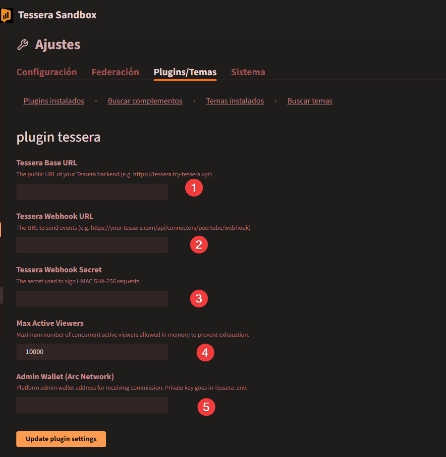
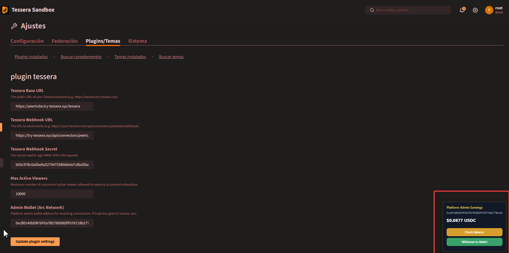
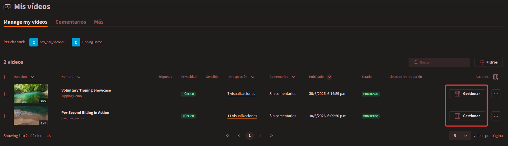
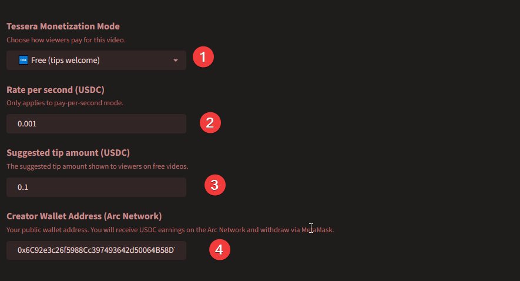
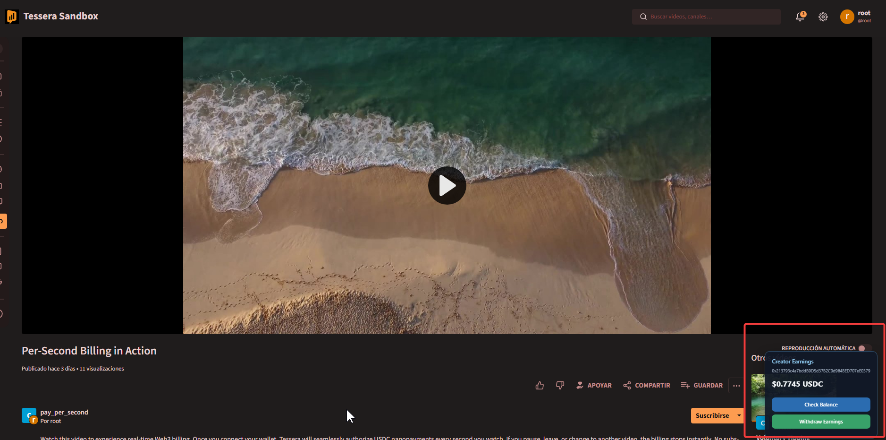

# Configuration

After installing the Tessera plugin on your PeerTube instance, you must configure the backend connection. The configuration is split into two parts: **Global Configuration** for the instance administrator, and **Channel Configuration** for individual content creators.

## Global Configuration (Administrator)

As the administrator of the PeerTube instance, you must link the plugin to your Tessera sidecar and configure your foundational platform wallet.

1. Log in to your PeerTube instance as an Administrator.
2. Go to **Administration** > **Plugins/Themes** > **Installed**.
3. Locate the **plugin tessera** and click **Settings**.

You will see the following configuration panel:

### Field Guide

1. **Tessera Base URL**: The public URL where your Tessera backend is running (e.g., `https://tessera.yourdomain.com`). This is the same URL you configured during the `npm run setup` process.
2. **Tessera Webhook URL**: The exact route where PeerTube will send server-side events. This must be your base URL appended with `/api/connectors/peertube/webhook`.
3. **Tessera Webhook Secret**: The `WEBHOOK_SECRET` randomly generated during your `npm run setup` process. You can find this inside your Tessera `.env` file. This ensures all communication is cryptographically signed and secure.
4. **Max Active Viewers**: The maximum number of concurrent viewers allowed in memory. `10000` is the recommended default to protect your server.
5. **Admin Wallet (Arc Network)**: Your public wallet address (e.g., `0x...`) on the Arc Network. This is a **mandatory** field.

> [!IMPORTANT]
> **Why the Admin Wallet is Required**
> The core Tessera engine uses your Admin Wallet as the foundational routing address to interface with the Circle Gateway. Without it, the engine will block all viewer deposits with a 400 Error. 
> By default, the system automatically routes a fixed **10%** of all per-second micropayments to this address to help cover your hosting costs, while the remaining **90%** goes directly to the creators. This uses a **deterministic tick-routing engine** rather than a percentage calculation at the end of the session, guaranteeing that exactly 1 out of every 10 nanopayments goes straight to the admin's wallet.

Once you have filled out these fields, click **Update plugin settings**.

### Platform Admin Withdrawals

Once the settings are successfully updated, the **Platform Admin Earnings** panel will become active on this settings page. This panel tracks accumulated fee earnings in real-time.

* **No External Wallet Required**: Because the admin wallet configuration is bound to your sidecar via PeerTube's settings, you do not need to connect an external web wallet to view your balance. The system automatically reads the state of the Admin Wallet registered on the sidecar's secure `.env` credentials.
* **Direct Settlement**: Click **Withdraw to Wallet** at any time to immediately transfer all accrued admin fees from the gateway directly to your registered Admin Wallet address.

## Channel Configuration (Creator)

Content creators can configure monetization settings independently for each of their uploaded videos.

### Step 1: Access Video Settings

1. Log in to your PeerTube account.
2. Navigate to **Mis vídeos** (or **Manage my videos**) from the left sidebar.
3. Locate the video you wish to monetize and click the **Gestionar** button on the right under the **Acciones** column.

### Step 2: Configure Monetization

Once inside the management panel, locate the **Tessera Monetization Mode** section. Configure the following fields:

1. **Tessera Monetization Mode**: Dropdown to select how viewers pay for the content.
   - *Free (tips welcome)*: Viewers can watch for free, but a floating tip widget is displayed.
   - *Pay-Per-Second*: Viewers are charged a micro-rate per second watched.
2. **Rate per second (USDC)**: The micro-payment cost per second of watch time (e.g., `0.001` USDC/sec). *Only applies to Pay-Per-Second mode.*
3. **Suggested tip amount (USDC)**: The default tip option presented to viewers on free videos (e.g., `0.1` USDC).
4. **Creator Wallet Address (Arc Network)**: The public EVM-compatible address (e.g., `0x...`) where you will receive USDC earnings. 

Click **Update** to save the changes.

### Step 3: Withdraw Creator Earnings

Creators do not need to access a separate administrative page to claim their earnings. The withdrawal system is built directly into the video player.

1. Navigate to the video playback page of your own video.
2. A floating **Creator Earnings** widget will automatically appear in the bottom-right corner of the player, showing your live accrued balance.
3. Click **Withdraw Earnings** to trigger a MetaMask prompt.
4. Approve the transaction to withdraw your accumulated USDC directly to your registered wallet on the Arc Network.

#### How It Works (Decentralized Non-Custodial Model)

Unlike the instance administrator, **Tessera NEVER stores the private keys of content creators.** PeerTube is a decentralized, multi-creator platform, so the withdrawal of video earnings operates using a secure, non-custodial model based on **EIP-712**:

1. **Verify Balance**: The PeerTube plugin queries the Tessera sidecar to fetch the creator's accumulated balance on the gateway.
2. **Withdrawal Request**: When the creator clicks **Withdraw Earnings**, Tessera prepares a `BurnIntent` specifying the exact withdrawal amount.
3. **Sign with MetaMask (EIP-712)**: A MetaMask prompt will ask you to cryptographically sign this withdrawal intent. This signature is off-chain, completely free, and consumes no gas.
4. **On-Chain Execution**: Tessera verifies the signature against the registered creator wallet. Once validated, Tessera (acting as the network operator) executes the transaction on-chain, transferring the USDC to your personal wallet.

## Viewer Wallet Setup (Viewer)

For viewers to fund their sessions, connect their wallets, and start watching or tipping, they need to set up their user-controlled wallet. You can direct your audience to the [Viewer Wallet Setup Guide](https://jadi03.github.io/tessera/tutorials/viewer-wallet/) for step-by-step instructions.

