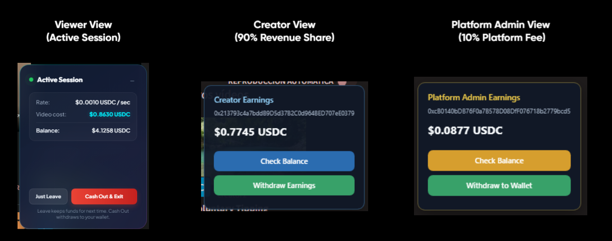
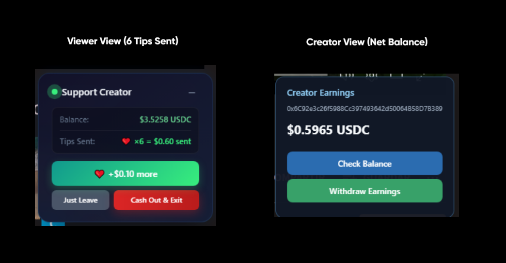
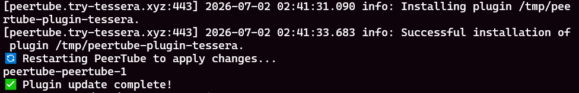
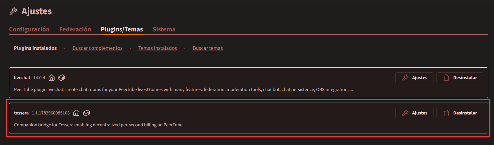

# PeerTube Integration

Tessera integrates natively with PeerTube via an official plugin, which handles loading and configuring the paywall directly into the video interface automatically.

> [!IMPORTANT]
> This guide assumes you have already successfully installed the Tessera backend following the [Quick Start](../../getting-started/index.md) guide and selected **Option 2 (PeerTube)** during the setup wizard.
> It also assumes you have a PeerTube instance running and Administrator access.

## The Sustainability Model (Plugin V1)

In the self-hosted ecosystem, instance administrators generously bear the heavy infrastructure costs (servers, storage, bandwidth) out of pocket. To create a sustainable environment for both hosts and creators, the **V1 Plugin** introduces a transparent value exchange system. 

Creators have two modes to receive direct financial support from their audience:

1. **Pay-Per-Second**: Best suited for premium content, courses, or exclusive streams. The audience pays a micro-rate for the exact time they watch. In this mode, the system automatically routes **10%** of the earnings to the instance administrator to help cover hosting costs, while the remaining **90%** goes directly to the creator. This fee split is powered by a **deterministic tick-routing engine** (e.g., exactly 1 out of every 10 nanopayments is routed directly to the admin's wallet), guaranteeing absolute mathematical fairness down to the micro-cent.
   
   
2. **Direct Tipping**: Available for any public video. Viewers can send one-off support directly from the video player. In this mode, **100%** of the tip goes directly to the creator.
   
   Viewer View (6 Tips Sent) & Creator View (Net Balance):
   

### Step 1: Clone and Install

The official Tessera plugin for PeerTube is not available in the public NPM registry, so it must be cloned and installed directly from its GitHub repository. We provide an automated script that builds the plugin, locates your PeerTube Docker container, cleans the cache, and safely installs the latest version.

SSH into your PeerTube server and run the following commands:

```bash
cd /opt/
git clone https://github.com/JaDi03/peertube-plugin-tessera.git
cd peertube-plugin-tessera
chmod +x update-plugin.sh
./update-plugin.sh
```



### Step 2: Verify in PeerTube
1. Log in to your PeerTube instance as an Administrator.
2. Go to **Administration** > **Plugins/Themes** > **Installed**.
3. Verify that the **Tessera Paywall Plugin** is listed and active.



Installation is complete. Please proceed to the [Configuration](configuration.md) guide to set up your platform fees and creator wallets.
