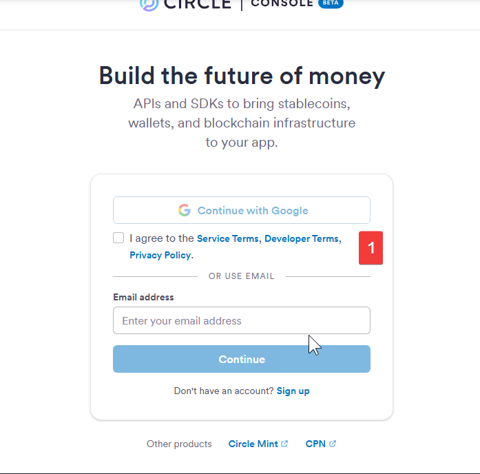
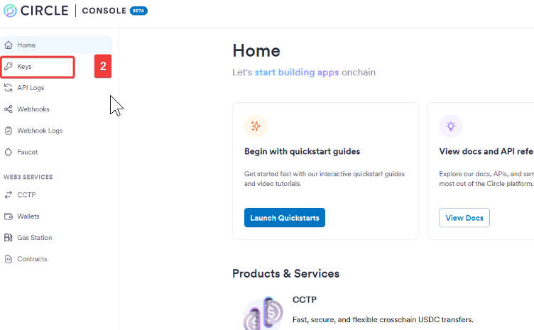
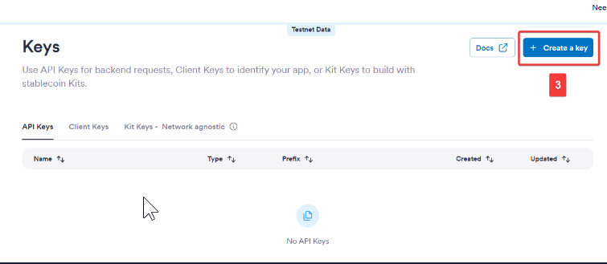
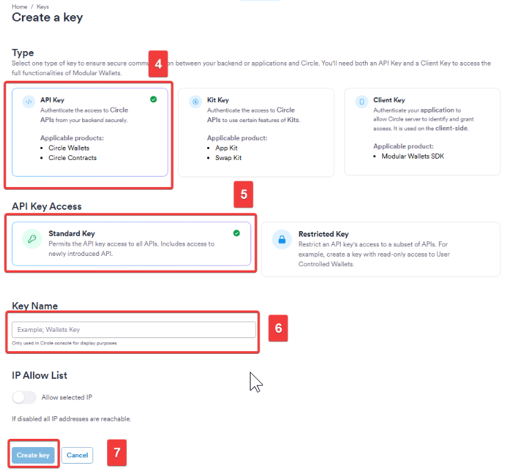
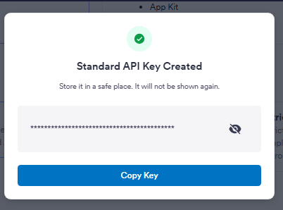

# How to get your Circle API Key

This tutorial walks you through the exact steps to generate your Backend API Key from the Circle Developer Console. This key is required for Tessera to securely communicate with Circle and create wallets on behalf of your users.

## Step-by-Step Guide

### Step 1: Log in to the Console

Log in to your Circle Developer Console.

### Step 2: Navigate to API Keys

Navigate to the Developers or Settings section to find the API Keys panel.

### Step 3: Create a New Key

Click the button to create a new API Key.

### Steps 4-7: Configuration

Follow the on-screen prompts to confirm the creation of your standard API key.

### Step 8: Copy Your Key

Once generated, copy the key immediately. This is the value you must paste into your `.env` file as `CIRCLE_API_KEY`. Keep it secure!

---

**Next:** Proceed to the [Circle App ID Tutorial](circle-app-id.md) to get your frontend credentials.
