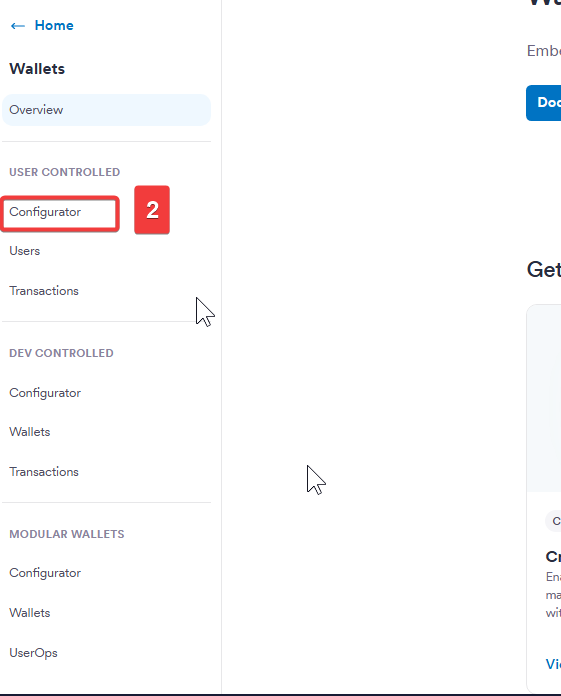
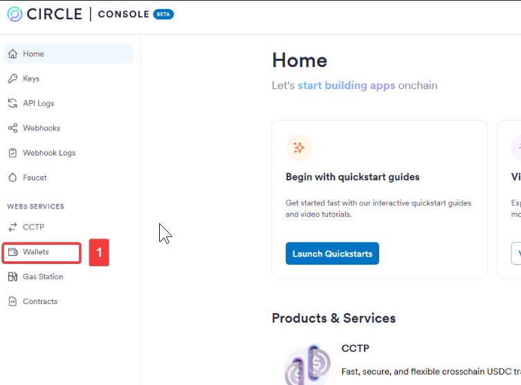
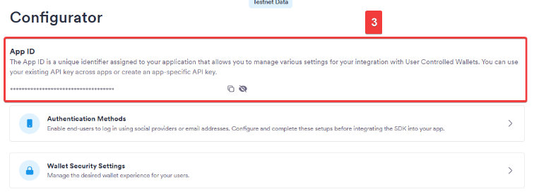

# How to get your Circle App ID

This tutorial explains how to locate your App ID in the Circle Developer Console. Tessera uses the App ID on the frontend so the Web3 Services SDK can initialize the Circle-hosted UI for wallet creation (the PIN and Email screens).

## Step-by-Step Guide

### Step 1: Navigate to Web3 Services

From your Circle Console dashboard, navigate to the **Web3 Services** section in the sidebar.

### Step 2: Select User Controlled

Under Web3 Services, select the **User Controlled** wallets option.

### Step 3: Copy Your App ID

You will see your application listed along with its unique App ID. Copy this value and paste it into your `.env` file as `CIRCLE_APP_ID`.

---

**Next:** With both your API Key and App ID secured, return to the [Quick Start guide](../getting-started/index.md#configure-environment-variables) to finalize your sidecar setup.
