# Viewer Wallet Guide

Tessera uses Circle's **User-Controlled Wallets** (UCW) to provide viewers with a non-custodial, secure, and fast payment experience directly from their browser. You don't need to install any browser extensions or manage seed phrases.

Here is a step-by-step guide on how viewers create their wallet, fund it, and withdraw their balance.

---

## 1. Creating Your Wallet

When you visit a premium stream or click the tipping button, the Tessera paywall will ask you to sign in with a PIN. If you do not have a wallet yet, the system will automatically guide you through the quick process of creating one.

Follow these steps to set up your wallet in seconds:

=== "Step 1: Sign in with PIN"
    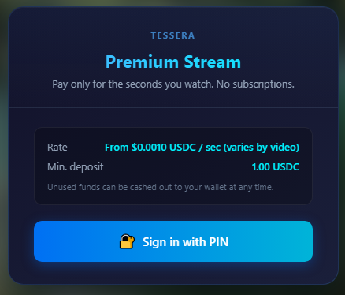
    
    Click **Sign in with PIN** (or **Enable Tipping**). This will automatically initialize a secure connection to Circle's wallet system.

=== "Step 2: Create a PIN"
    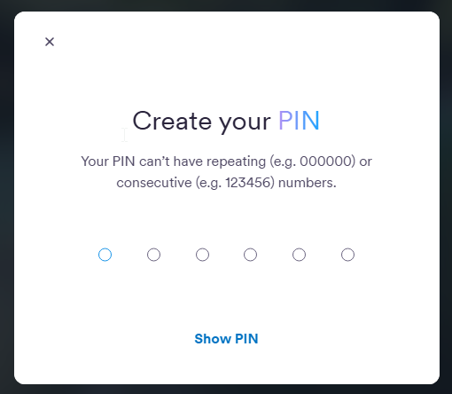
    
    Choose a secure 6-digit PIN. This PIN encrypts your wallet and is required to approve sessions, deposits, or cashing out. *Do not lose this PIN, as it cannot be reset.*

=== "Step 3: Confirm PIN"
    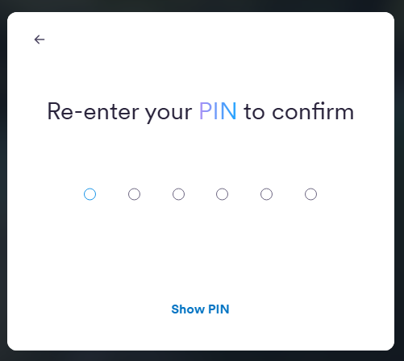
    
    Re-enter the 6-digit PIN you just created to verify and confirm it matches.

=== "Step 4: Set Recovery Method"
    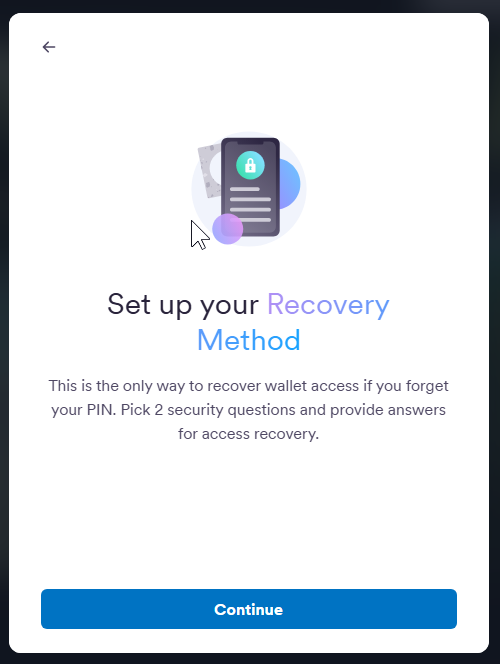
    
    Configure your wallet recovery method. This allows you to restore access to your wallet if you switch browsers or devices.

=== "Step 5: Recovery Questions"
    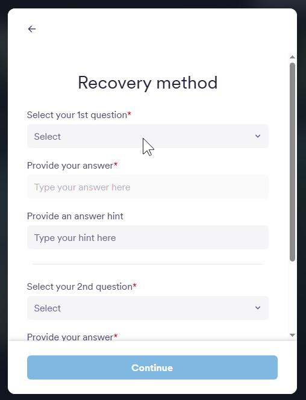
    
    Set and answer your security recovery questions. Keep these answers in a safe place.

=== "Step 6: Accept & Complete"
    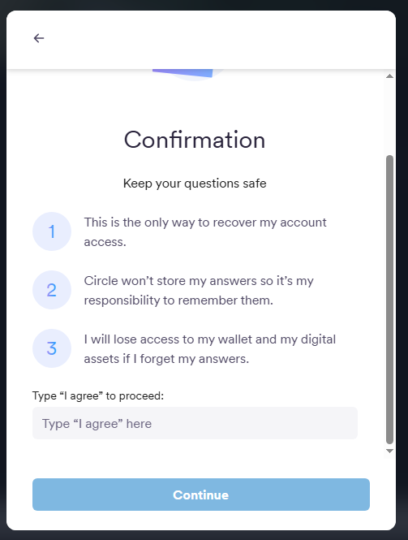
    
    Read the terms, type **"I agree"** in the input field, and click the confirmation button to complete the wallet setup.

---

## 2. Funding & Depositing

Tessera runs on the **Arc network** for sub-second, gas-free payments. To fund your session, you need USDC on your Arc wallet.

Once your wallet is created, the funding panel will open:

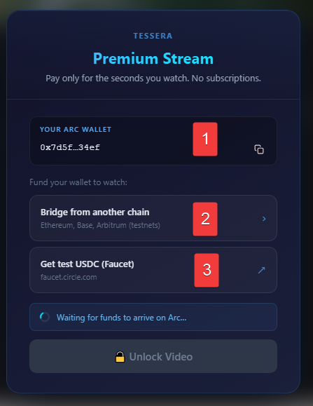

1. **Your Arc Wallet Address:** This is your unique address on the Arc network. You can copy it using the clipboard icon.
2. **Bridge from another chain:** Select this to transfer USDC from other networks (Ethereum Sepolia, Base Sepolia, Arbitrum Sepolia).
3. **Get test USDC (Faucet):** Click this to get free test USDC sent directly to your Arc wallet.

---

### How to use the Faucet (Direct Funding)

??? info "Show Faucet Step-by-Step"
    This is the easiest way to fund your wallet. Click the Faucet link to open Circle's testnet faucet:
    
    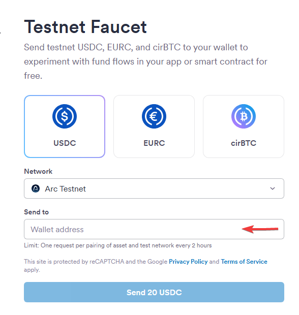
    
    1. Copy your Arc Wallet Address from the Tessera overlay.
    2. Paste your address in the **Wallet Address** input field.
    3. Under Network, select **Arc Testnet** to receive the funds directly.

---

### How to use the Bridge (CCTP)

??? info "Show Bridge Step-by-Step"
    If you already have USDC on other testnets, you can bridge them to Arc:
    
    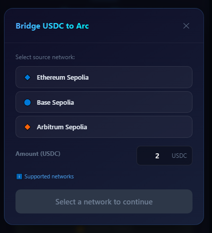
    
    1. Select the chain where you currently have testnet USDC.
    2. Enter the amount to bridge.
    3. Click the bridge button and approve the transactions in MetaMask.

---

## 3. Cashing Out (Withdrawing)

Unlike traditional subscriptions, Tessera only bills you for the exact seconds you watch. When you decide to leave, you have two options:

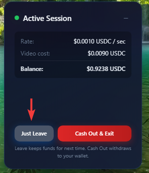

* **Just Leave (Pause Billing):** 
    Clicking **Just Leave** stops the billing timer. Your remaining balance stays safely in your Tessera session balance, ready for the next time you watch.

* **Cash Out & Exit:** 
    If you want your remaining funds returned, click **Cash Out & Exit**. 
    
    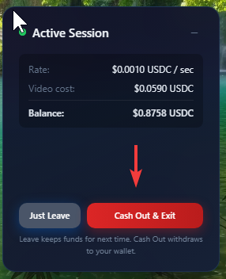
    
    The system will batch settle your session, pay the creator, and automatically transfer all your unused USDC back to your personal wallet. You will see a confirmation modal with a direct link to Arcscan to verify your on-chain transaction.
    
    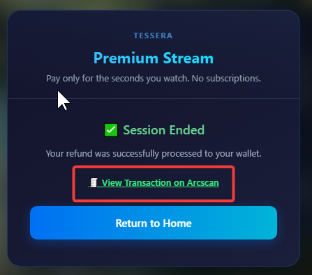
